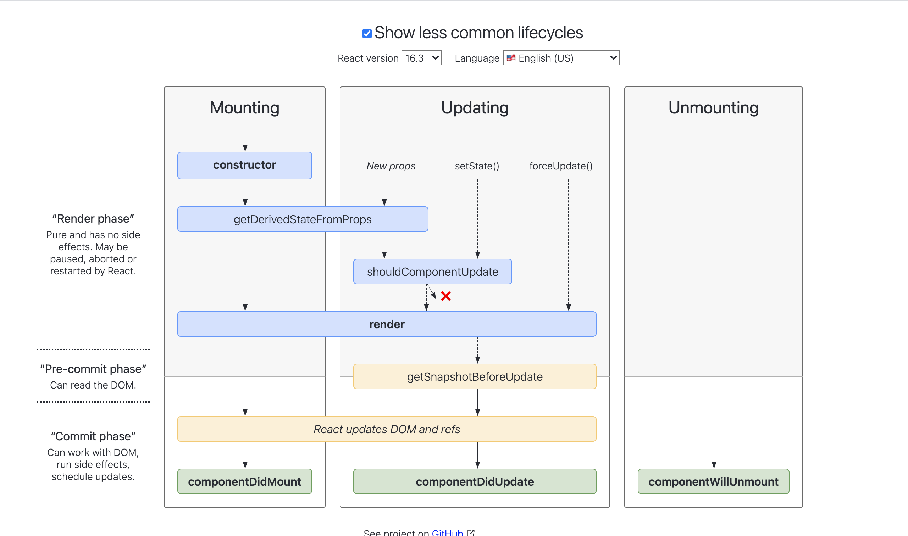
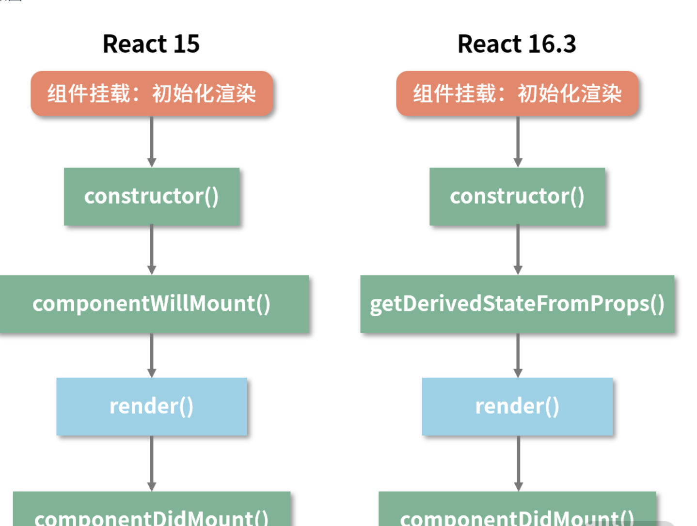
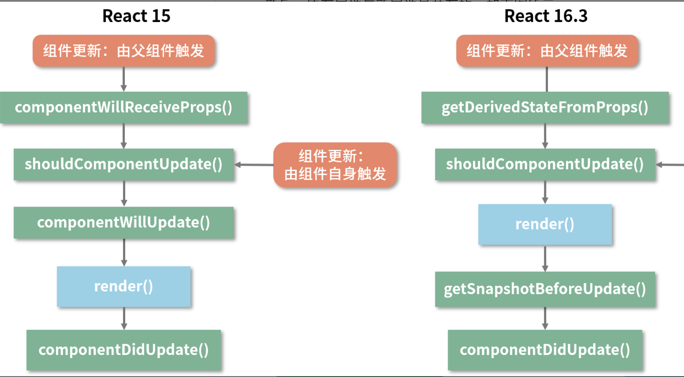

上一篇中，梳理学习了 React15 中的组件生命周期方法。 而到了React16，React官方又对生命周期做了些改动。那么改动是什么。又为什么改动呢？这一篇，就来继续学习 React16 中的生命周期，并尝试弄清楚 why。

## 进化组件的生命周期方法

网上有个开源项目的图，很好地整理 React16.3 的组件生命周期，如下：



之所以精确到了 16.3，是因为在 16.4 后，React 又做了微调，所以先理解 16.3 的

这次来写个简单 demo，把图中提到的生命周期写进去

```javascript
import React from 'react';
import ReactDOM from 'react-dom';

class Child extends React.Component {
  constructor() {
    console.log('子组件的constructor');
    super(props);
    this.state = {
      text: '子组件文本'
    };
  }
  //  初始化/更新时 调用
  static getDerivedStateFromProps(prop, state) {
    console.log('子组件的getDerivedStateFromProps');
    return {
      fatherText: props.text
    };
  }
  //  初始化渲染调用
  componentDidMount() {
    console.log('子组件componentDidMount');
  }
  //  render之前
  shouldComponentUpdate(prevProps, nextState) {
    console.log('子组件shouldComponentUpdate');
    return true;
  }
  //  render之后
  getSnapshotBeforeUpdate(prevProps, prevState) {
    console.log('子组件的getSnapshotBeforeUpdate');
    return 'xi xi';
  }
  //  组件更新后调用
  componentDidUpdate(preProps, preState, valueFromSnapshot) {
    console.log('子组件componentDidUpdate');
    console.log('从 getSnapshotBeforeUpdate 获取到的值是', valueFromSnapshot);
  }
  // 组件卸载时调用
  componentWillUnmount() {
    console.log('子组件的componentWillUnmount方法执行');
  }
  // 点击按钮，修改子组件文本内容的方法
  changeText = () => {
    this.setState({
      text: '修改后的子组件文本'
    });
  };
  render() {
    console.log('render方法执行');
    return (
      <div className="container">
        <button onClick={this.changeText} className="changeText">
          修改子组件文本内容
        </button>
        <p className="textContent">{this.state.text}</p>
        <p className="fatherContent">{this.props.text}</p>
      </div>
    );
  }
}

class Parent extends React.Component {
  // state 也可以像这样用类属性声明的形式初始化
  state = {
    text: '父组件的文本',
    hideChild: false
  };
  // 点击按钮，修改父组件文本的方法
  changeText = () => {
    this.setState({
      text: '修改后的父组件文本'
    });
  };
  // 点击按钮，隐藏（卸载）LifeCycle 组件的方法
  hideChild = () => {
    this.setState({
      hideChild: true
    });
  };
  render() {
    return (
      <div className="fatherContainer">
        <button onClick={this.changeText} className="changeText">
          修改父组件文本内容
        </button>
        <button onClick={this.hideChild} className="hideChild">
          隐藏子组件
        </button>
        {this.state.hideChild ? null : <LifeCycle text={this.state.text} />}
      </div>
    );
  }
}

ReactDOM.render(<LifeCycleContainer />, document.getElementById('root'));
```

React 16 以来的生命周期也可以按照“挂载”“更新”和“卸载”三个阶段来看，所以接下来我们要做的事情仍然是分阶段拆解工作流程。

## 组件挂载阶段

为了对比不同，我们将 15 和 16.3 的挂载阶段，画图表示一下：



从图中能明显看到，15 和 16.3 的差异在于，componentWillMount 消失了，新增了 getDerivedStateFromProps。

有些人对这种改变，会认为 React 16.3 在试图用 getDerivedStateFromProps 代替 componentWillMount，这种想法是不严谨的。**getDerivedStateFromProps 不是 componentWillMount 的替代品**。

事实上，componentWillMount 的存在不仅“鸡肋”而且危险，因此它并不值得被“代替”，它就应该被废弃。

getDerivedStateFromProps 这个 API，其设计的初衷不是试图替换掉 componentWillMount，而是试图替换掉 componentWillReceiveProps，因此它有且仅有一个用途：使用 props 来派生/更新 state。

React 团队为了确保 getDerivedStateFromProps 这个生命周期的纯洁性，直接从命名层面约束了它的用途（getDerivedStateFromProps 直译过来就是“从 Props 里派生 State”）。所以，如果我们不是出于这个目的来使用 getDerivedStateFromProps，原则上来说都是不符合规范的。

值得一提的是，getDerivedStateFromProps 在更新和挂载两个阶段都会“出镜”（这点不同于仅在更新阶段出现的 componentWillReceiveProps）。这是因为“派生 state”这种诉求不仅在 props 更新时存在，在 props 初始化的时候也是存在的。React 16 以提供特定生命周期的形式，对这类诉求提供了更直接的支持。

那么`getDerivedStateFromProps`的最佳使用方式什么呢

先看它的调用规则：

```js
static getDerivedStateFromProps(props, state) {
  console.log('子组件的getDerivedStateFromProps');
    return {
      fatherText: props.text
    };
}
```

使用它，主要注意以下：

1. getDerivedStateFromProps 是一个静态方法。静态方法不依赖组件实例而存在，在这个方法内部是访问不到 this 的
2. 该方法可以接收两个参数：props 和 state，它们分别代表当前组件接收到的来自父组件的 props 和当前组件自身的 state。
3. getDerivedStateFromProps 需要一个对象格式的返回值。getDerivedStateFromProps 的返回值之所以不可或缺，是因为 React 需要用这个返回值来更新（派生）组件的 state。因此当确实不存在“使用 props 派生 state ”这个需求的时候，最好是直接省略掉这个生命周期方法的编写，否则一定记得`return null`。
4. getDerivedStateFromProps 方法对 state 的更新动作并非“覆盖”式的更新，而是针对某个属性的定向更新。可以理解为`Object.assign(obj1, obj2)`这样来更新 state

## 组件更新阶阶段

同样的，我们也来看一张图



开头有说到 React 16.4 对生命周期流程进行了“微调”，其实就是微调在了更新阶段的`getDerivedStateFromProps`上。16.4 和 16.3 在挂载、卸载阶段上的生命周期函数一摸一样，就是更新阶段有所不同：

1. 在 React 16.4 中，任何因素触发的组件更新流程（包括由 this.setState 和 forceUpdate 触发的更新流程）都会触发 getDerivedStateFromProps；
2. 而在 v 16.3 版本时，只有父组件的更新会触发该生命周期。

到这里，又对`getDerivedStateFromProps`又有了更多了解，而 React 官方对这个 API 也有过描述

> getDerivedStateFromProps 与 componentDidUpdate 一起，这个新的生命周期涵盖过时 componentWillReceiveProps 的所有用例。

这句话包含了两个关键信息

1. getDerivedStateFromProps 是作为一个试图代替 componentWillReceiveProps 的 API 而出现的；
2. getDerivedStateFromProps 不能完全和 componentWillReceiveProps 画等号，其特性决定了我们曾经在 componentWillReceiveProps 里面做的事情，不能够百分百迁移到 getDerivedStateFromProps 里。

关于 getDerivedStateFromProps 是如何代替 componentWillReceiveProps 的，在“挂载”环节已经讨论过：getDerivedStateFromProps 可以代替 componentWillReceiveProps 实现基于 props 派生 state。

至于它为何不能完全和 componentWillReceiveProps 画等号，则是因为它过于“专注”了。这一点，单单从 getDerivedStateFromProps 这个 API 名字上也能感受到。原则上来说，它能做且只能做这一件事。

如果对设计模式有了解，其实会知道，一个 API 并非越庞大越复杂才越优秀。或者说得更直接一点，庞大和复杂的 API 往往会带来维护层面的“灾难”。

说回 getDerivedStateFromProps 这个 API，它相对于早期的 componentWillReceiveProps 来说，正是做了“合理的减法”。而做这个减法的决心之强烈，从 getDerivedStateFromProps 直接被定义为 static 方法这件事上就可见一斑—— static 方法内部拿不到组件实例的 this，这就导致你无法在 getDerivedStateFromProps 里面做任何类似于 this.fetch()、不合理的 this.setState（会导致死循环的那种）这类可能会产生副作用的操作。

因此，getDerivedStateFromProps 生命周期替代 componentWillReceiveProps 的背后，是 React 16 在强制推行“只用 getDerivedStateFromProps 来完成 props 到 state 的映射”这一最佳实践。意在确保生命周期函数的行为更加可控可预测，从根源上帮开发者避免不合理的编程方式，避免生命周期的滥用；同时，也是在为新的 Fiber 架构铺路。

回到更新阶段的讨论，从图可以看到：**消失的 componentWillUpdate 与新增的 getSnapshotBeforeUpdate**

先来看看`getSnapshotBeforeUpdate`的使用

```js
//  render之后
getSnapshotBeforeUpdate(prevProps, prevState) {
  console.log('子组件的getSnapshotBeforeUpdate');
  return 'xi xi';
}
```

这个方法和 getDerivedStateFromProps 颇有几分神似，它们都强调了“我需要一个返回值”这回事。区别在于 getSnapshotBeforeUpdate 的返回值会作为第三个参数给到 componentDidUpdate。它的执行时机是在 render 方法之后，真实 DOM 更新之前。在这个阶段里，我们可以同时获取到更新前的真实 DOM 和更新前后的 state&props 信息。

尽管在实际工作中，需要用到这么多信息的场景并不多，但在对于实现一些特殊的需求来说，没它还真的挺难办。这里我举一个非常有代表性的例子：实现一个内容会发生变化的滚动列表，要求根据滚动列表的内容是否发生变化，来决定是否要记录滚动条的当前位置。

这个需求的前半截要求我们对比更新前后的数据（感知变化），后半截则需要获取真实的 DOM 信息（获取位置），这时用 getSnapshotBeforeUpdate 来解决就再合适不过了。

值得一提的是，这个生命周期的设计初衷，是为了“与 componentDidUpdate 一起，涵盖过时的 componentWillUpdate 的所有用例”（引用自 React 官网）。getSnapshotBeforeUpdate 要想发挥作用，离不开 componentDidUpdate 的配合。

## 组件卸载

卸载阶段的生命周期与 React 15 完全一致，只涉及 `componentWillUnmount` 这一个生命周期

## 小结

React16 相比于 React15，最直接的感受就是，三个包括`will`的生命周期函数被干掉了，分别是`componentWillReceiveProps`、`componentWillMount`、`componentWillUpdate`，取而代之的是`getDerivedStateFromProps`和`getSnapshotBeforeUpdate`。而这些改动变厚，和 React 架构的变化也是存在关系的。
