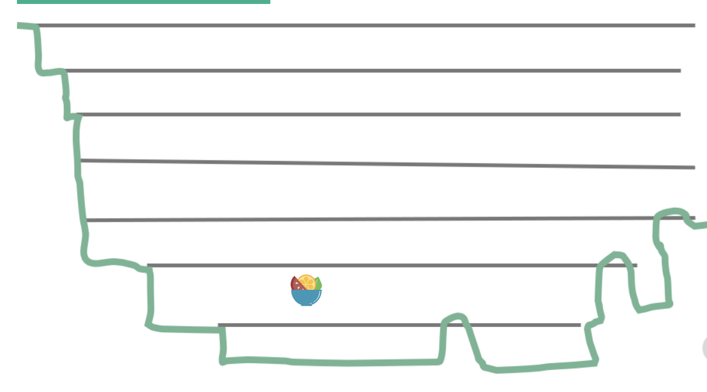
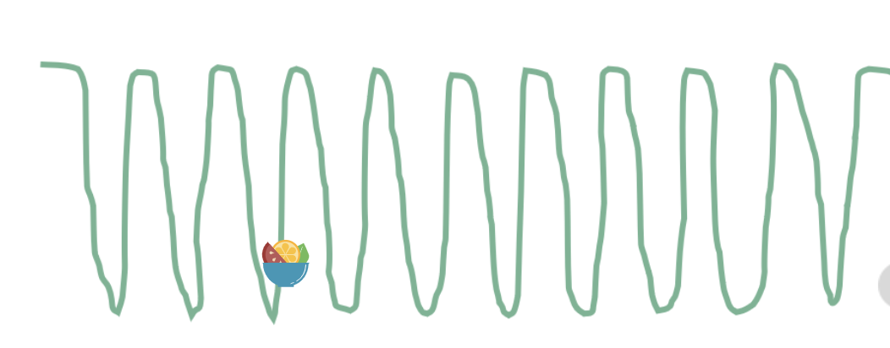

之前的文章聊到了 React15，React16 生命周期变动。React 官方积极变更生命周期的背后，其实是为了 Fiber 架构在铺路。

Fiber 是 React16 出来的概念，本质上是对 React 核心算法的一次重写。关于 Fiber，最核心的一个概念点就是：Fiber 会使原本同步的渲染过程变成异步的。

在 React 16 之前，每当我们触发一次组件的更新，React 都会构建一棵新的虚拟 DOM 树，通过与上一次的虚拟 DOM 树进行 diff，实现对 DOM 的定向更新。这个过程，是一个递归的过程。下面这张图形象地展示了这个过程的特征：

如图所示，同步渲染的递归调用栈是非常深的，只有最底层的调用返回了，整个渲染过程才会开始逐层返回。这个漫长且不可打断的更新过程，将会带来用户体验层面的巨大风险：同步渲染一旦开始，便会牢牢抓住主线程不放，直到递归彻底完成。在这个过程中，浏览器没有办法处理任何渲染之外的事情，会进入一种无法处理用户交互的状态。因此若渲染时间稍微长一点，页面就会面临卡顿甚至卡死的风险。

而 React 16 引入的 Fiber 架构，恰好能够解决掉这个风险：Fiber 会将一个大的更新任务拆解为许多个小任务。每当执行完一个小任务时，渲染线程都会把主线程交回去，看看有没有优先级更高的工作要处理，确保不会出现其他任务被“饿死”的情况，进而避免同步渲染带来的卡顿。在这个过程中，渲染线程不再“一去不回头”，而是可以被打断的，这就是所谓的“异步渲染”，它的执行过程如下图所示：

Fiber 架构的重要特征就是可以被打断的异步渲染模式。但这个“打断”是有原则的，根据“能否被打断”这一标准，React 16 的生命周期被划分为了 render 和 commit 两个阶段，而 commit 阶段又被细分为了 pre-commit 和 commit。每个阶段所涵盖的生命周期如下图所示：

我们先来看下三个阶段各自有哪些特征:

- render 阶段：纯净且没有副作用，可能会被 React 暂停、终止或重新启动。

- pre-commit 阶段：可以读取 DOM。

- commit 阶段：可以使用 DOM，运行副作用，安排更新。

总的来说，render 阶段在执行过程中允许被打断，而 commit 阶段则总是同步执行的。

为什么这样设计呢？简单来说，由于 render 阶段的操作对用户来说其实是“不可见”的，所以就算打断再重启，对用户来说也是零感知。而 commit 阶段的操作则涉及真实 DOM 的渲染，再狂的框架也不敢在用户眼皮子底下胡乱更改视图，所以这个过程必须用同步渲染来求稳。

在 Fiber 机制下，render 阶段是允许暂停、终止和重启的。当一个任务执行到一半被打断后，下一次渲染线程抢回主动权时，这个任务被重启的形式是“重复执行一遍整个任务”而非“接着上次执行到的那行代码往下走”。这就导致 render 阶段的生命周期都是有可能被重复执行的。

再来看看 React16 废弃的生命周期：

- componentWillMount；
- componentWillUpdate；
- componentWillReceiveProps

这些生命周期的共性，就是它们都处于 render 阶段，都可能重复被执行，而且由于这些 API 常年被滥用，它们在重复执行的过程中都存在着不可小觑的风险。

别的不说，说说能在日常项目里看到骚操作吧。在“componentWill”开头的生命周期里，有些人习惯于做的事情可能包括但不限于:

1. setState()；
2. fetch 发起异步请求；
3. 操作真实 DOM。

而这些操作写在`componentWill`的问题包括不限于：

1. 完全可以转移到其他生命周期（尤其是 componentDidxxx）里去做：比如在 componentWillMount 里发起异步请求。不少人以为，这样做就可以让异步请求回来得“早一点”，从而避免首次渲染白屏。可惜异步请求再怎么快也快不过（React 15 下）同步的生命周期。componentWillMount 结束后，render 会迅速地被触发，所以说首次渲染依然会在数据返回之前执行。这样做不仅没有达到你预想的目的，还会导致服务端渲染场景下的冗余请求等额外问题，得不偿失。
2. 在 Fiber 带来的异步渲染机制下，可能会导致非常严重的 Bug：假如我们在 componentWillxxx 里发起了一个付款请求。由于 render 阶段里的生命周期都可以重复执行，在 componentWillxxx 被打断 + 重启多次后，就会发出多个付款请求。
3. 很多习惯不好的开发者，在`componentWillReceiveProps`和`componentWillUpdate`滥用 setState

## 小结

React 16 改造生命周期的主要动机是为了配合 Fiber 架构带来的异步渲染机制。在这个改造的过程中，React 团队精益求精，针对生命周期中长期被滥用的部分推行了具有强制性的最佳实践。这一系列的工作做下来，首先是确保了 Fiber 机制下数据和视图的安全性，同时也确保了生命周期方法的行为更加纯粹、可控、可预测。
