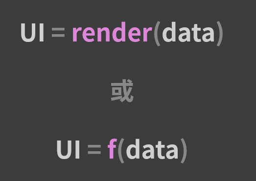

众所周知，React的核心特征是**数据驱动视图**，这个特征可用一张图来形容：



这个表达式有很多的版本，一些版本会把入参里的 data 替换成 state，但它们本质上都指向同一个含义，那就是React 的视图会随着数据的变化而变化。数据这个角色在 React 中的地位可见一斑。

在 React 中，如果说两个组件之间希望能够产生“耦合”（即 A 组件希望能够通过某种方式影响到 B 组件），那么毫无疑问，这两个组件必须先建立数据上的连接，以实现所谓的“组件间通信”。

“组件间通信”的背后是一套环环相扣的 React 数据流解决方案。

## 基于Props的单向数据流

React组件，从概念上来说，类似JavaScript函数。它可以接受任意的入参，也就是"Props"，然后返回描述页面内容的虚拟dom结构。

既然 props 是组件的入参，那么组件之间通过修改对方的入参来完成数据通信就是天经地义的事情了。不过，这个“修改”也是有原则的——你必须确保所有操作都在“单向数据流”这个前提下。

所谓单向数据流，指的就是当前组件的 state 以 props 的形式流动时，只能流向组件树中比自己层级更低的组件。 比如在父-子组件这种嵌套关系中，只能由父组件传 props 给子组件，而不能反过来。

听上去虽然限制重重，但用起来却是相当的灵活。基于 props 传参这种形式，我们可以轻松实现父-子通信、子-父通信和兄弟组件通信。

### 父-子组件通信

这是最常见、也是最好解决的一个通信场景。React 的数据流是单向的，父组件可以直接将 this.props 传入子组件，实现父-子间的通信。请看以下例子：

1. 子组件编码
```javascript
function Child(props) {
  return (
    <div className="child">
      <p>{`子组件所接收到的来自父组件的文本内容是：[${props.parentText}]`}</p>
    </div>
  );
}
```
1. 父组件编码
```javascript
import { useState } from 'react';
function Parent() {
    const [text, setText] = useState('init parent text');
    const changeText = () => {
        setText('changed parent text');
    };
    return (
        <div className="father">
            <button onClick={changeText}>
                点击修改父组件传入子组件的文本
            </button>
            {/* 引入子组件，并通过 props 下发具体的状态值实现父-子通信 */}
            <Child parentText={text} />
        </div>
    );
}
```

通过子组件顺利读取到父组件的 props.text，从这一点可以看出，父-子之间的通信是没有问题的。此时假如我们点击父组件中的按钮，父组件的 state.text 会发生变化，同时子组件读取到的 props.text 也会跟着发生变化，也就是说，父子组件的数据始终保持一致。

### 子-父组件通信

考虑到 props 是单向的，子组件并不能直接将自己的数据塞给父组件，但 props 的形式也可以是多样的。假如父组件传递给子组件的是一个绑定了自身上下文的函数，那么子组件在调用该函数时，就可以将想要交给父组件的数据以函数入参的形式给出去，以此来间接地实现数据从子组件到父组件的流动。

这里我们只需对父-子通信中的示例稍做修改，就可以完成子-父组件通信的可行性验证。

首先是对子组件的修改。在 Child 中，我们需要增加对状态的维护，以及对 Father 组件传入的函数形式入参的调用。子组件编码内容如下，修改点我已在代码中以注释的形式标出:

1. 子组件编码
```javascript
import { useState } from 'react';
function Child(props) {
    const [childText, setChildText] = useState('init child text');
    const changeParentText = () => {
        props.changeParentText(childText);
    };
    return (
        <div className="child">
            {/* 注意这里把修改父组件文本的动作放在了 Child 里 */}
            <button onClick={this.changeText}>
                点击更新父组件的文本
            </button>
        </div>
    )
}
```

1. 父组件编码

```javascript
import { useState } from 'react';
function Parent() {
    const [text, setText] = useState('init parent text');
    const changeText = () => {
        setText('changed parent text');
    };
    return (
        <div className="father">
            <button onClick={changeText}>
                点击修改父组件传入子组件的文本
            </button>
            {/* 引入子组件，并通过 props 下发具体的状态值实现父-子通信 */}
            <Child changeParentText={changeText} />
        </div>
    );
}
```

当点击子组件中的按钮时，会调用已经绑定了父组件上下文的 this.props.changeFatherText 方法，同时将子组件的 this.state.text 以函数入参的形式传入，由此便能够间接地用子组件的 state 去更新父组件的 state。

点击按钮后，父组件的文本会按照我们的预期被子组件更新掉

### 兄弟组件通信

兄弟组件之间共享了同一个父组件，组合使用之前说到的"父->子通信"、"子->父通信"，以此达到兄弟组件通信的效果。

## 为什么不推荐用 props 解决其他场景的需求

至此，我们给出了 props 传参这种形式比较适合处理的三种场景。尽管这并不意味着其他场景不能用 props 处理，但如果你试图用简单的 props 传递完成更加复杂的通信需求，往往会得不偿失。比如下面这种情况： A、B、C、D、E，从上至下依次嵌套。A 组件倘若想要和层层相隔的 E 组件实现通信，就必须把 props 经过 B、C、D 一层一层地传递下去。在这个过程中，反反复复的 props 传递不仅会带来庞大的工作量和代码量，还会污染中间无辜的 B、C、D 组件的属性结构。

层层传递的优点是非常简单，用已有知识就能解决，但问题是会浪费很多代码，非常烦琐，中间作为桥梁的组件会引入很多不属于自己的属性。短期来看，写代码的人会很痛苦；长期来看，整个项目的维护成本都会变得非常高昂。因此，**层层传递 props 
要不得**。

那有没有更加灵活的解决方案，能够帮我们处理“任意组件”之间的通信需求呢？答案是不仅有，而且还有很多。

这里先从最朴素的“发布-订阅”模式讲起。

## 利用“发布-订阅”模式驱动数据流

“发布-订阅”模式可谓是解决通信类问题的“万金油”，在前端世界的应用非常广泛，比如：

- 前两年爆火的 socket.io 模块，它就是一个典型的跨端发布-订阅模式的实现；
- 在 Node.js 中，许多原生模块也是以 EventEmitter 为基类实现的；
- Vue.js中，全局事件总线--EventBus

发布-订阅机制早期最广泛的应用，应该是在浏览器的 DOM 事件中。比如下面的代码：

```javascript
dom.addEventListener(type, listener, useCapture);
```

通过调用 addEventListener 方法，我们可以创建一个事件监听器，这个动作就是“订阅”。比如订阅 click（点击）事件：

```javascript
const subscribeClick = () => {console.log("点击事件发生时触发")};
buttonDom.addEventListner('click', subscribeClick, false);
```

当用户点击时， click 事件被触发，click便事件会被“发布”出去，进而触发订阅click事件的 subscribeClick 函数。这就是一个最简单的发布-订阅案例。

使用发布-订阅模式的优点在于，监听事件的位置和触发事件的位置是不受限的，就算相隔十万八千里，只要它们在同一个上下文里，就能够彼此感知。这个特性，太适合用来应对“任意组件通信”这种场景了。

## 发布-订阅模型API设计思路

通过前面的讲解，不难看出发布-订阅模式中有两个关键的动作：事件的监听（订阅）和事件的触发（发布），这两个动作自然而然地对应着两个基本的 API 方法。

- on()：负责注册事件的监听器，指定事件触发时的回调函数。

- emit()：负责触发事件，可以通过传参使其在触发的时候携带数据 。

最后，只进不出总是不太合理的，我们还要考虑一个 off() 方法，必要的时候用它来删除用不到的监听器：

- off()：负责监听器的删除。

## 发布-订阅模型的编码实现

现在让