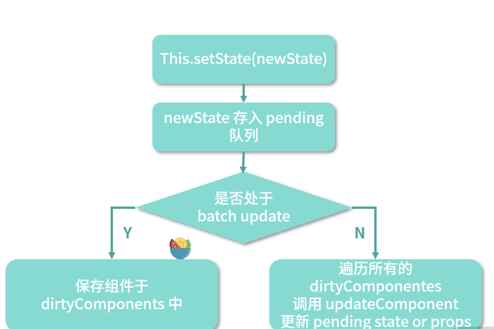

`setState`作为驱动组件更新的灵魂方法，经常会被问及是同步更新 state 还是异步更新 state。因为似乎在不同的场景下，`setState`的行为表现不一致。

要理清`setState`到底是同步更新还是异步更新，其实要分场景。而在了解`setState`的更新 state 机制之前，还需要了解一下 React 的合成事件，因为合成事件也跟`setState`的更新机制有关。

## 合成事件

React 为了更好地管控事件，利用事件委托机制，使用合成事件，模拟了真实的 DOM 事件，具体流程是这样的：

1. React 给 document 挂上事件监听；
2. DOM 事件触发后冒泡到 document；
3. React 找到对应的组件，造出一个合成事件出来；
4. 合成事件像真实 DOM 树一样，沿着组件树走一遍 捕获阶段-目标阶段-冒泡阶段；

因为合成事件机制，所以在一个页面中，只能有一个版本的 React。如果有多个版本，事件就乱套了。值得一提的是，这个问题在 React 17 中得到了解决，事件委托不再挂在 document 上，而是挂在 DOM 容器上，也就是 ReactDom.Render 所调用的节点上。

## setState 的异步场景

一般场景下，`setState`是异步的，比如

```js
class Test extends Component {
  state = {
    count: 0
  };
  componentDidMount() {
    this.setState(
      {
        count: this.state.count + 1
      },
      () => {
        console.log(this.state.count); //1
      }
    );
    console.log(this.state.count); // 0
  }
  render() {
    return <div>{this.state.count}</div>;
  }
}
```

在以上例子中，`setState`确实是异步的，且 log 符合直觉。那修改一下代码呢？

```js
class Test extends Component {
  state = {
    count: 0
  };
  componentDidMount() {
    //  这里 this.state.count是0
    this.setState(
      {
        count: this.state.count + 1
      },
      () => {
        console.log(this.state.count); //1
      }
    );
    //  这里 this.state.count还是0
    this.setState(
      {
        count: this.state.count + 1
      },
      () => {
        console.log(this.state.count); //1
      }
    );
  }
  render() {
    return <div>{this.state.count}</div>;
  }
}
```

咋一看，很容易以为 log 会输出 1，2,其实不会，如果重新仔细思考，我们会发现当前拿到的 this.state.count 的值并没有变化，都是 0，所以输出结果应该是 1,1。

再简单做个修改

```js
class Test extends Component {
  state = {
    count: 0
  };
  componentDidMount() {
    this.setState(
      (prevState) => ({
        count: prevState.count + 1
      }),
      () => {
        console.log(this.state.count); //2
      }
    );
    this.setState(
      (prevState) => ({
        count: prevState.count + 1
      }),
      () => {
        console.log(this.state.count); //2
      }
    );
  }
  render() {
    return <div>{this.state.count}</div>;
  }
}
```

我们可能以为又是 1，2，实际上是 2，2。为什么会这样呢？当调用 setState 函数时，就会把当前的操作放入队列中。React 根据队列内容，合并 state 数据，完成后再逐一执行回调，根据结果更新虚拟 DOM，触发渲染。所以回调时，state 已经合并计算完成了，输出的结果就是 2,2 了。

这非常反直觉，那为什么 React 团队选择了这样一个行为模式，而不是同步进行呢？一种常见的说法是为了优化。通过异步的操作方式，累积更新后，批量合并处理，减少渲染次数，提升性能。但同步就不能批量合并吗？这显然不能完全作为 setState 设计成异步的理由。

曾有人提出这样一个疑问“为什么 setState”是异步的，这个问题得到了 React 官方的回复，原因有两个：

1. 保持内部一致性。如果改为同步更新的方式，尽管 setState 变成了同步，但是 props 不是。
2. 为后续的架构升级启用并发更新。为了完成异步渲染，React 会在 setState 时，根据它们的数据来源分配不同的优先级，这些数据来源有：事件回调句柄、动画效果等，再根据优先级并发处理，提升渲染性能。

从 React 17 的角度分析，异步的设计无疑是正确的，使异步渲染等最终能在 React 落地。那什么情况下它是同步的呢？

## setState 同步场景

异步场景中的案例使我们建立了这样一个认知：setState 是异步的，但下面这个案例又会颠覆我们的认知。代码这样改造下：

```js
class Test extends Component {
  state = {
    count: 0
  };
  componentDidMount() {
    this.setState({ count: this.state.count + 1 });
    console.log(this.state.count); // 0
    setTimeout(() => {
      this.setState({ count: this.state.count + 1 });
      console.log(this.state.count); // 2
    });
  }
  render() {
    return <div>{this.state.count}</div>;
  }
}
```

此时的输出结果，不是 0，0，而是 0，2。因为 setState 并不是真正的异步函数，它实际上是通过队列延迟执行操作实现的，通过 isBatchingUpdates 来判断 setState 是先存进 state 队列还是直接更新。值为 true 则执行异步操作，false 则直接同步更新。看下图：



在 onClick、onFocus 等事件中，由于合成事件封装了一层，所以可以将 isBatchingUpdates 的状态更新为 true；在 React 的生命周期函数中，同样可以将 isBatchingUpdates 的状态更新为 true。那么在 React 自己的生命周期事件和合成事件中，可以拿到 isBatchingUpdates 的控制权，将状态放进队列，控制执行节奏。而在外部的原生事件中，并没有外层的封装与拦截，无法更新 isBatchingUpdates 的状态为 true。这就造成 isBatchingUpdates 的状态只会为 false，且立即执行。所以在 addEventListener 、setTimeout、setInterval 这些原生事件中都会同步更新。

## 小结

`setState`同步还是异步，要看具体场景。

在 React 类组件的声明周期，或者合成事件中，因为可以拿到`isBatchingUpdates`的控制权，所以`setState`走的是批量异步更新；而在`addEventListener`、`setTimeout`的原生事件中，因为没有 React 的封装和拦截，所以没有`isBatchingUpdates`的控制权，所以在原生事件中使用`setState`表现的就像同步了。

一般认为`setState`做异步设计是为了性能优化、减少渲染次数，React 团队还补充了两点：

1. 保持内部一致性。如果将 state 改为同步更新，那尽管 state 的更新是同步的，但是 props 不是。
2. 启用并发更新，完成异步渲染，为 Fiber 架构做铺垫。
